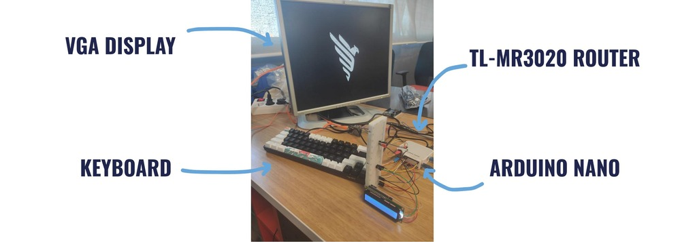
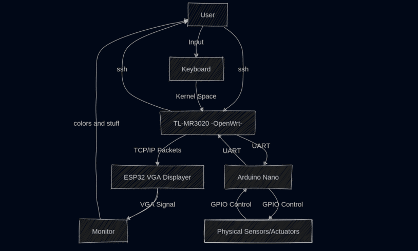

<div align="center">
    

  ### *Turning a Travel Router into a Distributed Desktop*

  **A distributed embedded system built around the TL-MR3020.**

  [ Architecture ](#-system-architecture) • [ The Protocols ](#-the-protocols) • [ Build Guide ](#-build--setup)

</div>

---

## 📖 Overview

The **3020 Project** transforms a limited consumer travel router (TP-Link TL-MR3020) into a functional computer with a display, keyboard, and physical I/O.

Since the router lacks the hardware to do this natively, we built a **Distributed System**. The router acts as the central orchestrator, offloading specialized tasks to **expansion modules** over network and serial links.

* **The Brain:** TL-MR3020 (OpenWrt Linux) — Orchestration & Logic.
* **The GPU:** ESP32 via TCP/IP — VGA Graphics.
* **The I/O:** Arduino Nano via Serial — Sensors & Actuators.
* **The Input:** USB Keyboard via a custom kernel driver.

---

## 🏗️ System Architecture

This repository acts as the **System Integrator**. It contains the OS configuration, the input driver, and links to the firmware submodules for the expansion devices.



### 📂 Repository Structure

| Directory | Type | Description |
| :--- | :--- | :--- |
| **`openwrt/`** | Core | OpenWrt build configs & overlay files. **Note:** Highly stripped to fit HID drivers. |
| **`keyboard/`** | Driver | The "Software Glue." Reads `/dev/input/event0`, splits output to TCP (Display) and Serial (Nano). |
| **`esp-vga/`** | **Submodule** | Firmware for the ESP32 VGA adapter. [View Repo](https://github.com/WNH-Organization/esp-VGA-Displayer) |
| **`nano/`** | **Submodule** | Firmware for the Arduino I/O bridge. [View Repo](https://github.com/WNH-Organization/3020-NANO) |
| **`docs/`** | Docs | *Wiring diagrams and architectural notes (In Progress).* |

---

## 📡 The Protocols

The system relies on human-readable text protocols to communicate between the Router, ESP32, and Nano.

### 1. Graphics Protocol (TCP/IP)
The ESP32 listens on **Port 1337**. It accepts newline-terminated text commands to draw text, change colors, or clear the screen.

👉 **Full Command Reference:** [Read the ESP-VGA-Displayer Documentation](https://github.com/WNH-Organization/esp-VGA-Displayer)

### 2. I/O Protocol (Serial)
The Arduino Nano listens on the router's internal serial port (`/dev/ttyATH0`) at **9600 baud**. It interprets text strings to control GPIO pins and I2C peripherals.

👉 **Full Command Reference:** [Read the 3020-NANO Documentation](https://github.com/WNH-Organization/3020-NANO)

---

## ⚡ Build & Setup

### 1. Clone Recursively
⚠️ **Important:** This repo uses submodules. You must clone recursively to pull the ESP and Nano firmware.

```bash
git clone --recursive [https://github.com/WNH-Organization/The-3020-Project.git](https://github.com/WNH-Organization/The-3020-Project.git)

```

### 2. The Router (OpenWrt)

Navigate to the `openwrt/` directory.
Due to the strict **4MB Flash limit** of the TL-MR3020 v1, we had to aggressively strip the OS to the bone.

* **Removed:** LuCI (Web UI) and all non-essential modules.
* **Added:** USB HID support (`kmod-usb-hid`, `kmod-input-core`, `kmod-input-evdev`) was prioritized to enable the keyboard.

Flash the generated `.bin` file to your router.

### 3. The Expansion Modules

* **ESP32:** Open `esp-vga/` in **PlatformIO** and flash.
* *Config:* Ensure it connects to the same Wi-Fi SSID as the router.


* **Nano:** Open `nano/` in **PlatformIO** or **Arduino IDE** and flash.
* *Wiring:* Connect Nano RX/TX to Router UART.
* ⚠️ **Warning:** You need a **voltage divider** or level shifter on the RX/TX lines to avoid damaging components. The Router operates at **3.3V** and the Nano at **5V**.


### 4. The Keyboard Driver

Compile the `keyboard/` program for the MIPS architecture (using the OpenWrt SDK).

```bash
# On the router
./3020_keyboard <ESP_IP> <ESP_PORT>

```

*Note: The port is configurable (default is 1337).*

---

## 🔌 Hardware LIST

* **Router:** TP-Link TL-MR3020 **v1**.
* **Microcontrollers:** ESP32 (WROOM-32), Arduino Nano (ATmega328P).
* **Display:** Standard VGA Monitor + [VGA Breakout](https://bitluni.net/esp32-vga).
* **Input:** Standard USB Keyboard.

---

## 🤝 Contributing

This project is part of the **[WNH Initiative](https://github.com/WNH-Organization)**.

* **Hardware Issues?** Check the wiring in `docs/` (Coming soon).
* **Software Bugs?** Open an issue in the relevant submodule.

**Maintainer:** Taha Ed-dafili ([@0rayn](https://www.google.com/search?q=https://github.com/0rayn))

---

<div align="center">
<sub>Built with ☕, Solder fumes, and stripped drivers in Morocco.</sub>
</div>